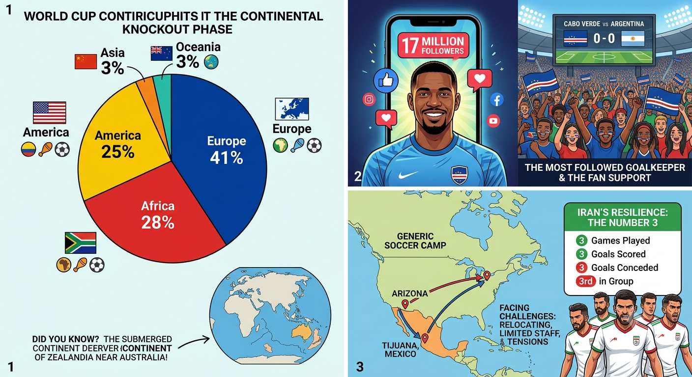

# 🏆 Football World Cup 2026 Journal

Welcome to my mobile matchday journal! I will be updating this page regularly throughout the entire tournament. 

---
## ⚽ Live Match Updates

## 2 choking and one lucky escape... 😲
First shock: *Die Mannschaft* is out. 🇩🇪❌
I only watched 5 minutes of it, then opted for a few hours of sleep so I could watch the Netherlands vs. Morocco game at 3 AM. What a game that was! 🤯
Luckily, my daughter—a big German supporter—watched the entire thing, extra time and penalties. She is "crying" 😢, but I must proudly say her analysis is completely spot on: Germany, even with 75% possession, just wasn't good enough. Gary Lineker, known for his famous football quotes, was brutal: *"This is one of the weakest German national teams I've ever seen."*

A friend told me while we were watching the Dutch play that my daughter had the luxury of supporting 4 teams: Senegal 🇸🇳, France 🇫🇷, the Netherlands 🇳🇱, and Germany 🇩🇪. With Germany already out, she was down to 3 while we watched. 📉

The game between NL and Morocco was so exciting! 🇳🇱🇲🇦 I still cannot believe Morocco scored in injury time. 😱 I was literally on my way to bed to catch a few hours of sleep before heading to work. 🥱 I am surely not the only one in the Netherlands who hasn't slept enough today! Plus, we have a company team photo today... this is officially the worst timing ever. 📸🤦‍♂️
Extra time was so boring; both teams were just waiting for penalties. 🥱 I even ironed my clothes for work while watching it. In the end, Morocco was overall the best team, and they won the penalty shootout. 🇲🇦🎉

A word on the new way of taking those penalties: Some players want to do a Panenka (but there is only *one* Panenka in the world! 🤷‍♂️), some walk up, some run and slow down. I am old-fashioned: just run and kick the ball! 🎯 From my humble couch, this is the most successful way. The Dutch lost because of those idiotic shots. 🤦‍♂️

As for Brazil, talk about a lucky escape! 🇧🇷🍀 They were really poor, but great teams do not miss opportunities given on a silver platter—capitalizing at the death after an unforgiving mistake from Japan.

And just like that, with the Netherlands out too, my daughter has only 2 teams left. ✌️🇫🇷🇸🇳

## ⚽ Archive

## The knockout phase round of 32- David vs Goliath

Knockout stage is not forgiving and it can be seen as the start of a new competition. We might see some surprises.

A bit of stats: 41% of the teams are from Europe, 25% from America, 28% from Africa, 3% from Asia (Japan made it), and 3% from Oceania (Australia did it though they compete in the Asia zone for the WC). Did you know an 8th submerged continent called Zealandia was discovered? Check it out. 

The 3 hosts of the WC are also through. The chance for an African or Asian country to make it to the final compared to a European is slim but not impossible. That said, one of the Americas teams has—historically—a better chance to reach that stage. Football can be seen as a religion in South America while in North America they call football soccer which is less popular. 

### The big story of this phase: Cabo Verde 🇨🇻

First qualification to the WC, survived the group stage and Vozinha the iconic goalkeeper has more than 17 million followers, he is the most followed goalkeeper. 🧤📲 A lot of people will be rooting for them in their next titanic game vs Argentina. 

The chance of Cabo Verde defeating the winner of the 2022 world cup is nil but a red card or an injury can change things. Who knows. No matter the result I am team Cabo Verde and team Africa.🇨🇻🌍

### A word on Iran 🇮🇷

They just missed out. This team faces so many challenges: geopolitical tensions, visa restrictions for the USA (they had limited technical staff), relocating from Arizona to Tijuana, Mexico and much more. 

Iran played 3 games, scored 3 goals, conceded 3 and finished 3rd in the group. They show resilience and 3 was or is their number.🏗️💪

Let's hope for exciting games.

----

## Sodade Revisited 🇨🇻🎶

Who hasn't heard of Cesária Évora? If you have not, type "Sodade" or her name into a search engine.
She was a Cape Verdean singer known for her distinct voice and her songs dedicated to melancholy, nostalgia, or the history of Cape Verde. She grabbed you by the guts, and one feels instantly connected with the morna music genre. She put this island on the map for a lot of people, and we can safely say the football team has brought back the spotlight. 🌟 In a sense, they are following her legacy.

As an old colony of Portugal, they are showing teeth and courage. People often underestimate the pain descendants of slaves carry, generation after generation. 🦅
They finished 2nd with 3 points and are qualified for the next round👏🏼. Forget about the fact that they'll meet the Argentina of Messi! 🇦🇷⚽

P.S. The Cape Verdean diaspora was already present in other legendary teams, like France 🇫🇷 with Patrick Vieira or Patrice Evra! 🇨🇻⚽"

I will do my best to visit Cape Verde, which is on a similar latitude as Gorée Island (worth visiting, you won't be the same after). Gorée (Senegal) 🇸🇳, where many left Africa for the "New World". But for now, I will listen to the Best of Cesária Évora and educate myself on Cape Verde—the archipelago of 10 volcanic islands located in the Atlantic Ocean, not far from Senegal. 🌊🌋

### African Team Updates 🌍⚽
Senegal won 5-0 after a rocky start ⛈️🌧️ and should make it to the next round, fingers crossed! 🤞 Ivory Coast 🇨🇮, Egypt 🇪🇬, South Africa 🇿🇦, and Morocco 🇲🇦 are already through to the next round.

------

### The blue and Zeus storm ⛈️⚡
Oops, Cabo Verde did it again. 🇨🇻 I watched the game knowing the result as I failed to wake up at midnight to see it live. My daughter tried but I was too comfy in the arms of Morpheus. 🛌💤 
The game was incredible and so enjoyable to watch.The players from Cape Verde scored first then conceded 2 goals, one before and one after halftime. And then the goalie of Uruguay 🇺🇾 made the wrong call—leaving his box—which was enough for Varela to score the equalizer. It was nerve-wracking to watch the last 30 minutes. Cabo Verde was exhausted but they held the result. 🙌 
They have a good chance to make it to the next round. However, will they recover enough to get something out of the last game of the group stage? Regardless, Miami Stadium experienced the Cabo Verde Storm. ⛈️🌪️

### The Philadelphia deluge 🌧️🌩️
The other storm happened in the beautiful city of Philadelphia. Town of Rocky Balboa—the stairs are impressive and the view from above stunning. 🥊 Town of the Rodin Museum—the collection is impressive—this is where I saw first a gender neutral toilet. Town of the famous Philadelphia cheesesteak—it was delicious with a local beer but I couldn't finish it. 🥪🍺
Back to the actual storm and lightning ⚡ that delayed the game of France 🇫🇷 vs Iraq 🇮🇶 for 2 hours after the 1st 45min. It was pouring down rain 🌧️ and for once I was glad to be in my bed. Funny enough, there was no water break in the second half—I guess the referee figured everyone had already seen, felt, and swallowed enough water to last a lifetime! 🏊‍♂️💦 
France won 3-0 but I wasn't impressed even if Iraq didn't present a threat.
It looks like Mbappé was chasing the top scorer record in a World Cup of Messi. 🏆⚽

-----

### 🛑 Good to know, I am not happy and I am disappointed

Finally, the first trio of female referees to referee a game happened during Czechia 🇨🇿 vs. South Africa 🇿🇦. It was about time 📯. I will ignore for now that the referees are from the United States 🇺🇸. 

*​(Let's make a parenthesis: I am shocked by the level of FIFA corruption; the executives do not even hide it anymore. I am disappointed.)*

I love the game, I played the game (amateur) for years, and now I watch the games whenever they're NOT behind a paywall. I am pissed, yes pissed, because now I barely watch football. This is the first time I have no clue which teams or players are best or spectacular from seeing the matches. So kudos to the Dutch broadcast NPO for showing all the games, and the same for the German broadcast ZDF (they dhow mist game). It is actually fun to watch the games on the German channel—one should try to watch a game in another language! My mum, bless her, "watches" the games via YouTube watch-alongs. 

A line about the water breaks: It is a joke! 💨 The water breaks are commercial breaks in disguise. Why does football have to change the rules for surely the US audience, so they can go to the loo or grab a chemical soft drink? And the cherry on the cake is that a lot of stadiums have air-conditioning, and most temperatures are around 20°C. Oh well. 

This leads to the carbon footprint of this World Cup. Delocalizing, yes, but polluting the planet even more? And high ticket prices? No. This is supposed to be accessible to all. 

Last but not least, I am guilty. Despite not approving of the way the WC was organized, I am still watching some games. I had the same dilemma when the WC was in Qatar 🇶🇦.

---

### 🟧 Orange fever

After a disappointing start against Japan 🇯🇵, the Dutch 🇳🇱 had an incredible game vs. Sweden 🇸🇪. 5-1! Brobbey, Gakpo, and Summerville—players from the Premier League 🏴󠁧󠁢󠁥󠁮󠁧󠁿—scored. I think Sweden 🇸🇪 brought on Elanga too late; he spiced up the game and was a delight to see. 

Watching the game at home was super fun. Each time the Dutch scored, guess what? Fireworks. It took a while for the 1st one—my guess is the fans needed time to go into the attics or garden houses to find them. The Dutch and their fireworks 🎆 it's a love story. In the stadium, we had Queen Máxima and King Willem-Alexander; they are sports aficionados. 

I'll finish on this funny and very telling note. One could see a few Dutch supporters in the stadium with the following message on their shirts: *Houston, we have a solution!*

The other game, Germany 🇩🇪 vs. Ivory Coast 🇨🇮, almost finished with an upset. IC 🇨🇮 scored first. They were threatening in their orange shirts. It took more than 30 minutes for Germany 🇩🇪 to score. I was about to go to bed when at 90+4, the Germans did it again. So they are through to the next round, but Ivory Coast 🇨🇮 failed to preserve that draw. IC 🇨🇮 will certainly go through, though. 

Orange was the color of my evening! 🟧

---
### 🌍 Africa rocks!

We all know since 2010 "Waka Waka" from Shakira, which was taken from the original Cameroonian 🇨🇲 makossa song "Zamina mina (Zangaléwa)". In 2026, "this time for Africa" is so true.

Following Cabo Verde's 🇨🇻 feat, look at those AMAZING resulst:

1. **Morocco** 🇲🇦 held the Brazil 🇧🇷 to a 1-1 draw! Ismael Saibari scored a beautiful goal to put them ahead, and even though Vinícius Júnior equalized. Morocco 🇲🇦 is  strong team and they can go far.
2. **Egypt** 🇪🇬 got a 1-1 draw against Belgium 🇧🇪 on Mo Salah's birthday. Belgium 🇧🇪 was saved by a crazy own goal.
3. **Senegal** 🇸🇳 held a draw in the 1st half against France 🇫🇷 (one of the best teams on paper). They scored a fantastic goal but couldn't compete with Les Bleus and Kylian Mbappé when they switched to 6th gear. 3-1 end result.
4. **DR Congo (RDC)** 🇨🇩 leveled 1-1 with the well-seasoned Cristiano Ronaldo and Bruno Fernandes of Portugal 🇵🇹. Honestly, RDC 🇨🇩 deserved to win and could have won, but this is where experience makes the difference. They were amazing!
5. **Ghana** 🇬🇭 won against Panama 🇵🇦 1-0.

The other matches which I didn't see show a very good English team 🏴󠁧󠁢󠁥󠁮󠁧󠁿. They won 4-2 against Croatia 🇭🇷. Harry Kane is still one of the best number 9 strikers, and maybe they will finally bring it home.

Outside of Africa, the Middle Eastern teams did great too—Iran 🇮🇷 and Saudi Arabia 🇸🇦 didn't lose and grabbed a point. 

Looking at the fantastic results, African countries are getting closer and closer to the cup!

-----

### 🇨🇻 Vozinha, the goalkeeper, the hero of Cabo Verde

Cabo Verde, a small African island nation of only 500,000 people, managed to draw 0-0 against Spain, one of the favorites and holder of the European cup. This is actually more embarrassing than Switzerland. 

Cabo Verde players, following the example of their 40-year-old goalkeeper, fought successfully very hard. Anyone watching the game, perhaps except Spanish supporters, wanted them to score. Vozinha, who has played mostly at home throughout his career, was the man of the match. 

Here are the stats: Spain had 75% possession, but Cabo Verde’s goalkeeper made 7 huge saves. 

And the fun part? Vozinha went into the game with only 50,000 Instagram followers. Today, he already has over 6.8 million! And the number is growing. It's crazy—he now has more followers than the entire population of his own country multiplied by ten. 

Not to forget, this is the same African island team that eliminated Cameroon to get here. 

### 🇨🇼 Curaçao: A True David vs. Goliath. 

Curaçao is the smallest team of the tournament with around 160,000 inhabitants. This Caribbean island, known for its beaches, managed to: 
1. Qualify for the World Cup — a historical moment!
2. Score a goal against *Die Mannschaft*. That is not a small achievement.
3. Show they (almost) never give up, never surrender.

I was impressed by the football skills of the team but Juninho Bacuna is the one player that stood out . I was craving a Jearl Margaritha 😇 moment when he came into the game as a substitute. 

The fact that almost all the players were born in the Netherlands is irrelevant. If you look closely at most teams, plenty of players are eligible through their parents or grandparents.

Bravo Curaçao, the Caribbean is proud! The result is very telling though: 7-1 for 🇩🇪 Germany. It would have been embarrassing for Germany to not have won by such a margin, but they still let one goal in.

**The Rest of the Games**
🇨🇮 Ivory Coast stole a win in the 89th minute. This is a move typical of big, successful teams. They often play badly and are dominated, but they have 100% efficiency. Is it a sign that Ivory Coast will make it to the final? Time will tell.

🇸🇪 Sweden destroyed Tunisia 🇹🇳 5-1.

----

### 🛌 Sleeping Beauty

🇧🇷 Brazil vs. Morocco 🇲🇦
I spontaneously woke up at midnight, however at 19:00 I was fast asleep, probably snoring!

I watched a bit of it. 🇲🇦 Morocco was the better team and rightly so scored with a nice lob. I am not a fan of Morocco since the Africa Cup and the "keeper towel-gate" incident. They won on paper but on the field they lost vs 🇸🇳 Senegal. Vinicius Jr. scored a self-made goal and brought 🇧🇷 Brazil back into the game. Final result 1-1.

The other games (watched the highlights) saw respectively the win of 🏴󠁧󠁢󠁳󠁣󠁴󠁿 Scotland vs. Haiti 🇭🇹, and 🇦🇺 Australia vs. Türkiye 🇹🇷; and an (embarrassing) draw between 🇶🇦 Qatar and Switzerland 🇨🇭. 

Maybe they are no longer smaller teams.

------ 

### 🇨🇦 Friday's Second Opening Ceremony & Game

I love Canada and I have fond memories of Toronto, so it pains me to say that the ceremony was somewhat disappointing. I suppose I was expecting too much! To top it off, the giant World Cup trophy replica on the pitch had a bit of a wardrobe malfunction when its cover got stuck.

However, the acknowledgment of the Indigenous peoples of Canada was a beautiful touch. I didn't recognize any of the opening pop performers, though my daughter did. To me, the music all sounds like Shakira's style, but I guess that is just a generational thing! The stadium wasn't entirely full, but I think the fans were just waiting for Michael Bublé. His performance was AMAZING—absolutely my kind of music. Canada did well there!

**The Match: 🇨🇦 Canada 1-1 Bosnia and Herzegovina 🇧🇦**
History! This was the first-ever World Cup point for Les Rouges (Canada). Canada was the better team overall, but they had to come from behind to get the draw. Bosnia gave it their all—they played with their whole hearts as if this game were a final. It was highly entertaining football, and it kept me wide awake!

Funny note: The Toronto stadium had a lot of empty sections, and the bright red seats could easily trick TV spectators into thinking the stadium was packed, since Canada was wearing full red jerseys!

---

### 🇺🇸 The Third Opening Ceremony & USA Kickoff

I watched this one in fast-replay mode. The USA is known for doing things bigger than anyone else, and they can certainly put on a show! 

I was incredibly impressed by Tius Luka, the 10-year-old Norwegian singer who performed alongside Katy Perry. Another highlight was the national anthem of Paraguay, which was beautifully sung by performers in traditional clothing. Then, the US national anthem absolutely lifted the roof off the stadium. 

Speaking of the Los Angeles stadium—it is a beautiful, $5,5 billion chef-d'oeuvre. The show, too long for a football fan like me, concluded with a flyover by three helicopters. A new American World Cup tradition, perhaps? 

The USA won their opening game easily, but it started way too late for me to watch live!

--------

### 🟥 Red, Red, and Red: The Opening Ceremony & Game

The opening ceremony was absolutely worth watching. We had Andrea Bocelli, Shakira & Burna Boy, David Guetta, and other massive artists for the younger generation. It was lively and distinctly Mexican with a modern twist. The actress Salma Hayek officially launched the tournament!

**The Match: 🇲🇽 Mexico 2-0 South Africa 🇿🇦**
Mexico won 2-0, and it was well deserved. Interestingly, the referees are wearing body cameras now so the audience can experience the exact view of the man with the whistle. I was hoping for a female referee to take charge of the opener, though!

🇿🇦 South Africa was messy in their play, committed loads of fouls, and ended up with two players expelled. 🇲🇽 One Mexican player also received a straight red card right at the end of the match. So, red was definitely the colour of the day.

I struggled to stay awake but managed to see the final whistle! I decided against watching the 03:00 game, but 🇰🇷 South Korea won their match.

------'
### The Delocalised World Cup (11 June-19 July 2026)

The 2026 Football World Cup will take place across three different countries in North America: 🇨🇦 Canada, 🇲🇽 Mexico, and the 🇺🇸 USA. 
Delocalising sport events are not a new concept. The famous Tour de France often has a few stages outside France. The last Olympics in France were also delocalised. 
It is important to notice that teams like Ukraine or Palestine are not playing at home for a while due to War.
So delocalisation is the word of the month and the year. Word that should actually supports EDI (Equity, Diversity & Inclusivity). Though sadly it is far from that reality in some cases.

Back to the game I love: I hope an African country (go Morocco 🇲🇦 - ​Tunisia 🇹🇳 - Egypt 🇪🇬 - ​Algeria 🇩🇿 - Ghana 🇬🇭 - Cabo Verde 🇨🇻 ​-South Africa 🇿🇦 ​- Côte d'Ivoire 🇨🇮 (Ivory Coast) - Senegal 🇸🇳 ) will win the title this time, or at least make it to the final. For those of us based in Europe, the games are often at 21:00 or 03:00, with some at 05:00 or 23:00. It is more fun like this! 😊

